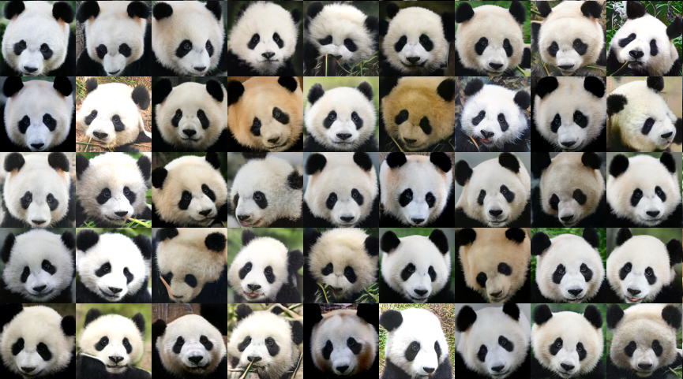

# Few-Shot Generative Modelling Architectures Analysis

This repository contains the evaluation code, generated samples, and the full research report for our exploratory analysis of Generative Modelling under Data Constraint (GM-DC).

📄 **[Read the Full 63-Page Report Here](./docs/Few_Shot_Generative_Modelling_Analysis.pdf)**

## 📌 Overview
Generative models typically require vast amounts of data, rendering them impractical for constrained domains like medical imaging or rare archives. This project systematically evaluates state-of-the-art GM-DC architectures operating in extreme low-shot regimes (10 to 100 samples). 

The source code in this repository focuses on four primary architectures evaluated in the study:
* **StyleGAN2-ADA**
* **DANI** (Dual Adaptive Noise Injection)
* **FakeCLR**
* **InsGen**

## 📊 The "FID Illusion"
Through a standardized benchmarking pipeline using 8 distinct metrics (FID, KID, LPIPS, MS-SSIM, Precision, Recall, Density, Coverage), we empirically validated the **"FID Illusion"** in constrained settings. 

Quantitative evidence demonstrates that models achieving robust Fréchet Inception Distances frequently suffer from severe mode collapse and critically suppressed Recall unless initialized with high-resolution source priors (e.g., FFHQ transfer learning).

## 🖼️ Generated Samples
*(Sample outputs from extreme low-shot generation)*

